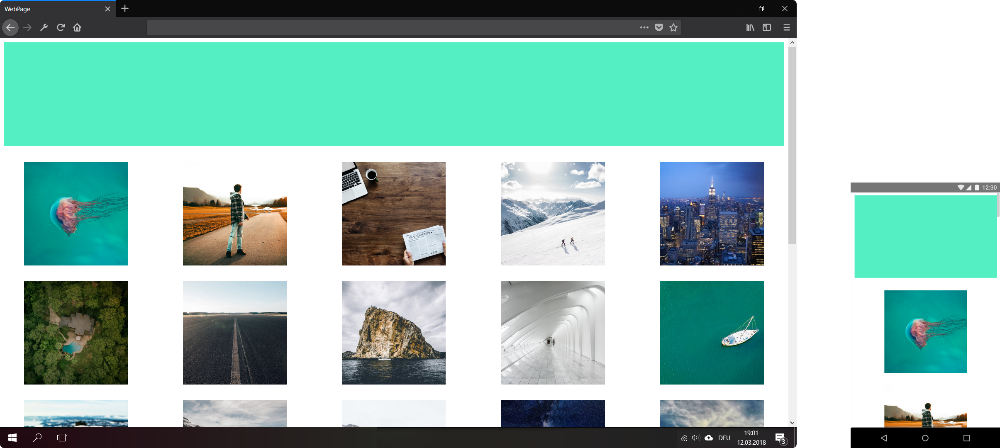

# WebPage
## General
This project demonstrates the basic power and responsiveness of the CSS grid. The images have a fixed size and the grid tries to fit as many images as possible in one row. If the size gets too small the item/image will jump to the next row.

visit: https://johannesdev.github.io/WebPage/

## TODO
- [x] CSS Grid setup
- [x] Test Pexels implementation
- [ ] Randomise image fetching with Pexels API
- [ ] Randomise color for header and footer

## Special thanks
Thanks to pexels for providing the api as well as the pictures.
